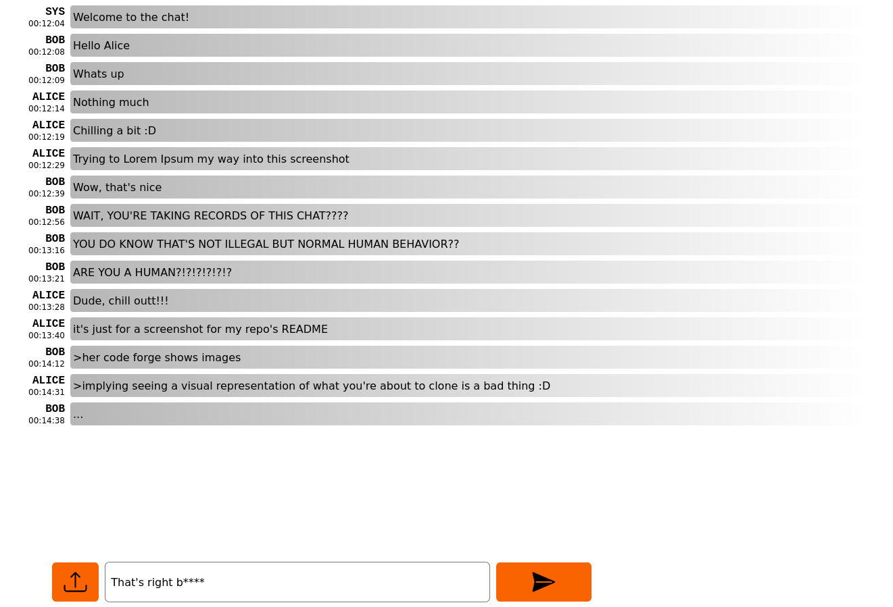

# Go Chat (with friends)

Non persistent chat (go) server and (js) client to instantly chat with whomever you want but only if they're in close proximity such that NATing doesn't impose nefarious shackles on your (network's) freedom.

    
 
    	
    

    super awesome image ^^

## Features

- Only one chat room
- Text messages :D
- File upload & display

Todo:

- Multiple chat rooms

## Quick start

Switch to the `src/` directory.

Optionally compile the `index.ts` into `index.js`:

`tsc`

Run the server:

`go run .`

Visit `http://localhost:8080` and login as `admin` with `cutest` as password.

## Configuration

The server accepts the following environment variables:

| OPTION                    | DEFAULTS                      | DESCRIPTION                 |
|---------------------------|-------------------------------|-----------------------------|
| `PORT`                    | `8080`                        | Server's port               |
| `AUTH`                    | `admin:cutest;dio:itwas`      | Users and their credentials |
| `MAX_FILE_SIZE`           | `128`                         | Max file upload size (MiB)  |

Example config:

`PORT="80" AUTH="alice:wonderland;bob:fatherland;jojo:painland" MAX_FILE_SIZE="21" go run .`
